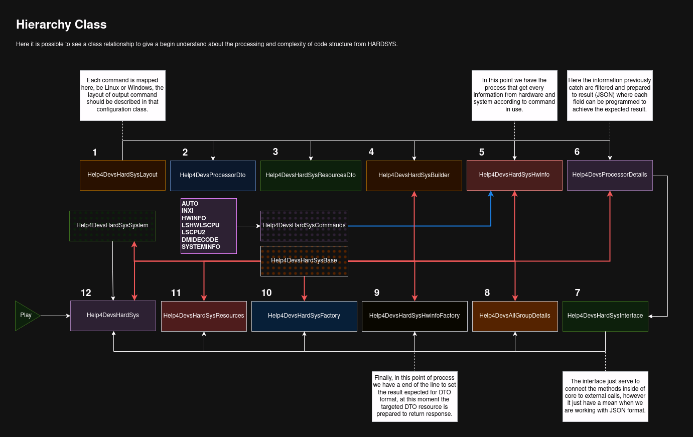

# HARDSYS

## Available Versions according Java Version

| Java Version | HardSys Version | Status |
|--------------|-----------------|--------|
| Java8        | 1.8.1           | WORK   |
| Java11       | 1.11.1          | TODO   |
| Java17       | 1.17.1          | TODO   |
| Java21       | 1.21.1          | TODO   |

> See more in the branch selector: 1.8.1, 1.11.1 and ...

## Overview on processing flow

Below it is possible to see the complete flow of processing to get the information about hardware and system from 
specific linux command that ca be:

- Supported commands

| CMD Name   | Status | Linux | MacOs | Windows | Others |
|------------|--------|-------|-------|---------|--------|
| AUTO       | TODO   | yes   | yes   | no      | n/a    |
| INXI       | DONE   | yes   | yes   | no      | n/a    |
| HWINFO     | DONE   | yes   | yes   | no      | n/a    |
| LSHW       | DONE   | yes   | no    | no      | n/a    |
| LSCPU      | TODO   | yes   | no    | no      | n/a    |
| LSPCI      | TODO   | yes   | no    | no      | n/a    |
| LSUSB      | TODO   | yes   | no    | no      | n/a    |
| DMIDECODE  | TODO   | yes   | yes   | no      | n/a    |
| SYSTEMINFO | TODO   | no    | no    | yes     | n/a    |

> The AUTO command will be checking if each command of the list above can be executed successfully, but the sequence of 
execution in the hierarchy is programmed to be in the follow way:

###### For Linux Operating System

- AUTO
- INXI
- HWINFO
- LSHW
- LSCPU
- LSPCI
- LSUSB
- DMIDECODE

In case that any command be correctly executed an Exception will be thrown informing the error, for example: 
"Command NOT FOUND". 

###### For Windows

<small>The only command available for windows is systeminfo</small>

- AUTO
- SYSTEMINFO

## How to execute this library via CLI

You can run this program via cli passing the commands available in this documentation, for example:

<pre>
sudo ${JAVA_HOME}/java -jar help4devs-commons-1.0.0-SNAPSHOT.jar {{{HARDSYS-COMMAND}}} --spring.config.location=${PATH_APP}/application.properties
</pre>

## Managing the resources (technical details - for developers)

The topics below shows how to add a new resource in the flow and programming that one, however it can be used to remove 
or block some resource as well. You must follow these steps if you want to get a good and satisfied result in your development.

We will to consider that it is necessary to add a resource called Multimedia, and that resource just offers simple 
information like id, name, description, and details.

- Resource: Multimedia

#### STEP-1

**class:** Help4DevsHardSysLayout

**package:** com.huntercodexs.demo.system.hardsys.core;

**description:** Add the new resource in the correct layout details.

**about:** Before move for tests and even for development check if the layout of current command offers one result that
consist of the new resource, in case so, it is required to add the resource in that class configuration to match the
results and resources during the process, for example the command hwinfo has a layout that ca be seen in the below
output

<pre>
cpu:                                                            
                       Intel(R) Core(TM) i5-9300H CPU @ 2.40GHz, 2400 MHz
                       Intel(R) Core(TM) i5-9300H CPU @ 2.40GHz, 2400 MHz
                       Intel(R) Core(TM) i5-9300H CPU @ 2.40GHz, 2400 MHz
                       Intel(R) Core(TM) i5-9300H CPU @ 2.40GHz, 2400 MHz
                       Intel(R) Core(TM) i5-9300H CPU @ 2.40GHz, 3192 MHz
                       Intel(R) Core(TM) i5-9300H CPU @ 2.40GHz, 2400 MHz
                       Intel(R) Core(TM) i5-9300H CPU @ 2.40GHz, 2400 MHz
                       Intel(R) Core(TM) i5-9300H CPU @ 2.40GHz, 2400 MHz
keyboard:
  /dev/input/event9    MosArt Wireless Keyboard/Mouse
  /dev/input/event4    AT Translated Set 2 keyboard
mouse:
  /dev/input/mice      MosArt Wireless Keyboard/Mouse
  /dev/input/mice      SHARKOON 2.4G Mouse
  /dev/input/mice      SYNA7DB5:01 06CB:CD41 Mouse
  /dev/input/mice      SYNA7DB5:01 06CB:CD41 Touchpad
monitor:
                       LG ELECTRONICS LG HDR WFHD
                       BOE HF LCD Monitor
graphics card:
                       nVidia VGA compatible controller
                       Intel UHD Graphics 630 (Mobile)
sound:
                       Intel Cannon Lake PCH cAVS
                       nVidia Audio device
storage:
                       Intel Cannon Lake Mobile PCH SATA AHCI Controller
                       Sandisk WD Black 2018/PC SN520 NVMe SSD
network:
  wlp8s0               Intel WLAN controller
  enp7s0               Realtek RTL8111/8168/8411 PCI Express Gigabit Ethernet Controller
network interface:
  br-1222323251ed      Ethernet network interface
  lo                   Loopback network interface
  docker0              Ethernet network interface
  wlp8s0               Ethernet network interface
  br-6a9bcd66bcea      Ethernet network interface
  enp7s0               Ethernet network interface
  br-809eca8ee88a      Ethernet network interface
disk:
  /dev/nvme0n1         Sandisk WD Black 2018/PC SN520 NVMe SSD
partition:
  /dev/nvme0n1p1       Partition
  /dev/nvme0n1p2       Partition
usb controller:
                       Intel Cannon Lake PCH USB 3.1 xHCI Host Controller
bios:
                       BIOS
bridge:
                       Intel ISA bridge
                       Intel Xeon E3-1200 v5/E3-1500 v5/6th Gen Core Processor PCIe Controller (x16)
                       Intel Cannon Lake PCH PCI Express Root Port #15
                       Intel 8th Gen Core 4-core Processor Host Bridge/DRAM Registers [Coffee Lake H]
                       Intel Cannon Lake PCH PCI Express Root Port #9
                       Intel Cannon Lake PCH PCI Express Root Port #14
hub:
                       Linux Foundation 2.0 root hub
                       Linux Foundation 3.0 root hub
memory:
                       Main Memory
bluetooth:
                       Intel Bluetooth Device
unknown:
                       FPU
                       DMA controller
                       PIC
                       Keyboard controller
                       Intel Xeon E3-1200 v5/v6 / E3-1500 v5 / 6th/7th Gen Core Processor Gaussian Mixture Model
                       Intel Cannon Lake PCH Serial IO I2C Controller #1
                       Intel Cannon Lake PCH HECI Controller
                       Intel Cannon Lake PCH SPI Controller
                       Intel Communication controller
                       Intel Cannon Lake PCH Thermal Controller
                       Intel Cannon Lake PCH Serial IO I2C Controller #0
                       Intel Cannon Lake PCH Shared SRAM
                       Intel Cannon Lake PCH SMBus Controller
                       Chicony Electronics HD User Facing
</pre>

Below is an example of code that we are mentioned in this step

<code>

    ...
    public abstract class Help4DevsHardSysLayout {
        ...
        //HWINFO Version 21.68 (Layout)
        protected static final String[] hwinfoLayout = new String[] {
                ...
                "multimedia:"
        };
        ...
    }

</code>

#### STEP-2

**class:** Help4DevsMultimediaDto

**package:** com.huntercodexs.demo.system.hardsys.dto;

**description:** Create a DTO class file for a new resource.

**about:** This class is a abstraction of hardware and system information related to any specific resource, that 
can be for example: processor, memory disk, etc... see one simple example below to have a better idea about:

<code>

    package com.huntercodexs.demo.system.hardsys.dto;
    
    import java.util.List;
    
    public class Help4DevsMultimediaDto {
    
        private List<String> id;
        private List<String> name;
        private List<String> source;
        private List<String> description;
    
        public Help4DevsMultimediaDto() {}
    
        public List<String> getId() {
            return id;
        }
    
        public void setId(List<String> id) {
            this.id = id;
        }
    
        public List<String> getName() {
            return name;
        }
    
        public void setName(List<String> name) {
            this.name = name;
        }
    
        public List<String> getSource() {
            return source;
        }
    
        public void setSource(List<String> source) {
            this.source = source;
        }
    
        public List<String> getDescription() {
            return description;
        }
    
        public void setDescription(List<String> description) {
            this.description = description;
        }
    
        public String toString() {
            return "Help4DevsMultimediaDto[" +
                    "id=" + id +
                    ", name=" + name +
                    ", source=" + source +
                    ", description=" + description +
                    ']';
        }
    }

</code>

#### STEP-3

**class:** Help4DevsHardSysResourcesDto

**package:** com.huntercodexs.demo.system.hardsys.dto;

**description:** Include the new resource in the main DTO class.

**about:** This class is a final response from the processing, so be careful on make change in it following the 
steps below one by one to get the correct result. First create the attribute for the target resource, 
for example: multimedia, and remember that this resource is related to DTO class created previously. 

<code>

    public class Help4DevsHardSysResourcesDto {
        ...
        private Help4DevsMultimediaDto multimedia;
        ...
    }

</code>

#### STEP-3.1

**class:** Help4DevsHardSysResourcesDto

**package:** com.huntercodexs.demo.system.hardsys.dto;

**description:** Create de get method for the new resource.

**about:** In this step it will be created the get method to access the Multimedia resource, it is pretty simple:

<code>

    public class Help4DevsHardSysResourcesDto {
        ...
        public Help4DevsMultimediaDto getMultimedia() {
            return multimedia;
        }
        ...
    }

</code>

#### STEP-3.2

**class:** Help4DevsHardSysResourcesDto

**package:** com.huntercodexs.demo.system.hardsys.dto;

**description:** Also create the set method for the new resource.

**about:** Now it is required to create a set method to change the attribute value during the processing, just follow 
the code below, but give more attention in the line when say this.multimedia = (Help4DevsMultimediaDto) multimedia and 
try to understand why the cast is present in that. 

<code>

    public class Help4DevsHardSysResourcesDto {
        ...
        public void setMultimedia(Object multimedia) {
            this.multimedia = (Help4DevsMultimediaDto) multimedia;
        }
        ...
    }

</code>

#### STEP-3.3

**class:** Help4DevsHardSysResourcesDto

**package:** com.huntercodexs.demo.system.hardsys.dto;

**description:** Add the new resource in the toString method.

**about:** Finally, make an updated int the toString() method to including this new resource in the results. 

<code>

    public class Help4DevsHardSysResourcesDto {
        ...
        public String toString() {
            ...
            return "Help4DevsHardSysMetricsDto[" +
                ...
                ", multimedia=" + multimedia +
            "]";
        }
        ...
    }

</code>

#### STEP-4

**class:** Help4DevsHardSysBuilder

**package:** com.huntercodexs.demo.system.hardsys.core;

**description:** Include the new resource in the builder class.

**about:** After we have created the resources in the main sources class it is necessary to register the new resource 
in the Builder class according piece of code below. In this point it is very important to keep in mind that the 
hardsys() method expect a parameter that are correctly related to Help4DevsHardSysResourcesDto class, because during 
the processing that value will be checked and in case there any inconsistency, one error it will be thrown, so the 
parameter "multimedia" has the same value of the attribute "private Help4DevsMultimediaDto multimedia;" in the class 
mentioned in this text earlier.

<code>

    public class Help4DevsHardSysBuilder extends Help4DevsHardSysBase {
        ...
        public Help4DevsHardSysResourcesDto build() {
            Help4DevsHardSysResourcesDto dto = new Help4DevsHardSysResourcesDto();
            ...
            dto.setMultimedia(this.transport.get(hardsys("multimedia")));
            return dto;
        }
        ...
    }

</code>

#### STEP-5

**class:** Help4DevsHardSysHwinfo

**package:** com.huntercodexs.demo.system.hardsys.command;

**description:** Add the new resource in the translator process.

**about:** This class processing data for JSON and DTO formats results, is one of the most complicated topics in that 
flow, because this class have a total responsibility to get all information throughout the command executed. The main 
method to be care is fieldsTranslator() that have is according to command layout and HARDSYS resources. When this 
class is instanced and the method run() is called, the process try to get information from current machine and system 
and put these values in the shared attribute named "resources". This step is very important, because in case that occurs 
anny kind of issue, the rest of the process will be died and probably the result will be not as expected.

<code>

    ...
    public class Help4DevsHardSysHwinfo extends Help4DevsHardSysBase {
        ...
        private String fieldsTranslator(String input) {
            return input
                ...
                .replaceAll("multimedia:", hardsys("multimedia"))
                ...
        }
    ...

</code>

#### STEP-6

**class:** Help4DevsMultimediaDetails

**package:** com.huntercodexs.demo.system.hardsys.processing;

**description:** Create a new detail class for a new resource.

**about:** At this point, the things become to be a little bit complicated and requires more attention to avoid mistakes 
and keep in the correct way to develop a resource successfully. All resources should expose a getDetails() method to 
be accessed from a call of HardSys, for example:

<pre>
    Help4DevsHardSys hardSys = new Help4DevsHardSys(HWINFO);
    hardSys.json();
    
    //SYSTEM
    Help4DevsSystemDetails system = hardSys.resources().getSystem();
    System.out.println(system.getDetails());
    //--MACHINE
    Help4DevsMachineDetails machine = hardSys.resources().getMachine();
    System.out.println(machine.getDetails());
    //--BATTERY
    Help4DevsBatteryDetails battery = hardSys.resources().getBattery();
    System.out.println(battery.getDetails());
    //--MULTIMEDIA
    Help4DevsMultimediaDetails multimedia = hardSys.resources().getMultimedia();
    System.out.println(multimedia.getDetails());
</pre>

In the above code its possible to see that each resource is offering a getDetails() to retrieve information that 
was previously generated. However, pay attention, this method only works if the requested result is JSON format 
that it is possible to see in the line 

<pre>
    hardSys.json()
</pre>

In case the expected result is a DTO object, it can be ignored, bellow is a model class to help developer decrease the 
development time, give a deep look inside the method getDetails() and see that each command have your specific method 
to process the details and let everything prepared for the next steps.

<code>

    package com.huntercodexs.demo.system.hardsys.processing;
    
    import com.huntercodexs.demo.system.hardsys.command.Help4DevsHardSysCommands;
    import com.huntercodexs.demo.system.hardsys.core.Help4DevsHardSysBase;
    
    import java.util.ArrayList;
    import java.util.List;
    
    import static com.huntercodexs.demo.services.parser.Help4DevsParserService.jsonCreatorRFC8259;
    
    public class Help4DevsMultimediaDetails extends Help4DevsHardSysBase {
    
        private final String resName = "multimedia";
        private final String resNameUpper = resName.toUpperCase();
        private final Help4DevsHardSysCommands command;
        private final List<String> multimediaDetails;
    
        public Help4DevsMultimediaDetails(List<String> devices, Help4DevsHardSysCommands command) {
            this.command = command;
            this.multimediaDetails = devices;
        }
    
        private List<String> detailsFromLinuxCommandInxi() {
            List<String> filter = new ArrayList<>();
            for (String details : this.multimediaDetails) {
                filter.add(details.replaceAll(resNameUpper+": ", resName+": "));
            }
            return filter;
        }
    
        private List<String> detailsFromLinuxCommandHwinfo() {
            List<String> filter = new ArrayList<>();
            for (String details : this.multimediaDetails) {
                if (details == null || details.isEmpty()) continue;
                filter.add(detailsFilter(details, "name"));
            }
            return filter;
        }
    
        private List<String> detailsFromLinuxCommandLshw() {
            List<String> filter = new ArrayList<>();
            for (String details : this.multimediaDetails) {
                filter.add(details.replaceAll(resNameUpper+": ", resName+": "));
            }
            return filter;
        }
    
        private List<String> detailsFromLinuxCommandLscpu() {
            List<String> filter = new ArrayList<>();
            for (String details : this.multimediaDetails) {
                filter.add(details.replaceAll(resNameUpper+": ", resName+": "));
            }
            return filter;
        }
    
        private List<String> detailsFromLinuxCommandLscpu2() {
            List<String> filter = new ArrayList<>();
            for (String details : this.multimediaDetails) {
                filter.add(details.replaceAll(resNameUpper+": ", resName+": "));
            }
            return filter;
        }
    
        private List<String> detailsFromLinuxCommandDmidecode() {
            List<String> filter = new ArrayList<>();
            for (String details : this.multimediaDetails) {
                filter.add(details.replaceAll(resNameUpper+": ", resName+": "));
            }
            return filter;
        }
    
        public String getDetails() {
            if (this.command.equals(Help4DevsHardSysCommands.INXI)) {
                return jsonCreatorRFC8259(detailsFromLinuxCommandInxi(), hardsys(resName));
            } else if (this.command.equals(Help4DevsHardSysCommands.HWINFO)) {
                return jsonCreatorRFC8259(detailsFromLinuxCommandHwinfo(), hardsys(resName));
            } else if (this.command.equals(Help4DevsHardSysCommands.LSHW)) {
                return jsonCreatorRFC8259(detailsFromLinuxCommandLshw(), hardsys(resName));
            } else if (this.command.equals(Help4DevsHardSysCommands.LSCPU)) {
                return jsonCreatorRFC8259(detailsFromLinuxCommandLscpu(), hardsys(resName));
            } else if (this.command.equals(Help4DevsHardSysCommands.LSCPU2)) {
                return jsonCreatorRFC8259(detailsFromLinuxCommandLscpu2(), hardsys(resName));
            } else if (this.command.equals(Help4DevsHardSysCommands.DMIDECODE)) {
                return jsonCreatorRFC8259(detailsFromLinuxCommandDmidecode(), hardsys(resName));
            }
            throw new RuntimeException("Invalid command for "+ hardsys(resName) +": " + this.command);
        }
    
    }

</code>

#### STEP-7

**class:** Help4DevsHardSysInterface

**package:** com.huntercodexs.demo.system.hardsys.core;

**description:** Add the new resource in the interface class.

**about:** After the changes before, it very recommended and correct to register the new resource in the interface 
class called, according piece of code below, it is pretty easy.

<code>

    package com.huntercodexs.demo.system.hardsys.core;

    import com.huntercodexs.demo.system.hardsys.group.*;
    import com.huntercodexs.demo.system.hardsys.processing.*;
    
    public interface Help4DevsHardSysInterface {
        ...
        Help4DevsMultimediaDetails getMultimedia();
        ...
    }

</code>

#### STEP-8

**class:** Help4DevsAllGroupDetails

**package:** com.huntercodexs.demo.system.hardsys.group;

**description:** Add the new resource to All Groups.

**about:** This class is used just when the request or calling is for all resources in the result and not for DTO
format, so be careful with that class during the development.

<code>

    ...
    private List<String> detailsFromLinuxCommandHwinfo() {
        return Arrays.asList(
            ...
            this.allResources.getMultimedia().getDetails());
    }
    ...

</code>

#### STEP-9

**class:** Help4DevsHardSysHwinfoFactory

**package:** com.huntercodexs.demo.system.hardsys.core.factory;

**description:** Programming the Factory class.

**about:** This class only make process for DTO format results. In this class the data will be prepared for the factory 
process and get everything done for the next and final steps. Is in that class that we need to put all code to process 
every resource previously extracted from the current linux command, such as "hwinfo". All methods in this class obey 
the hierarchy and logical from a current layout provident from the command chosen by user. It is very important to give 
a better attention in that step and method, because here is how the things will be presented in the result, so put the 
hands on the job and give your best.

> IMPORTANT: In this class all resources that were previously captured are converted in a specific DTO format 

<code>

    ...
    public class Help4DevsHardSysHwinfoFactory extends Help4DevsHardSysBase {
        ...
        private void multimediaFactory(List<String> items) {
    
             //Testing...
             Help4DevsMultimediaDto multimedia = new Help4DevsMultimediaDto();
             multimedia.setId(Arrays.asList("1","2"));
             multimedia.setName(Arrays.asList("test","test"));
    
             this.transport.put(hardsys("multimedia"), multimedia);
    
        }
        ...
        public void factory() {
            ...
            multimediaFactory(this.resources.get(hardsys("multimedia")));
            ...
        }
    }

</code>

####  STEP-10

**class:** Help4DevsHardSysFactory

**package:** com.huntercodexs.demo.system.hardsys.core;

**description:** To serve as a bridge between resource dto and commands.

####  STEP-11

**class:** Help4DevsHardSysResources

**package:** com.huntercodexs.demo.system.hardsys.core;

**description:** Add the new resource main and final HARDSYS resource class.

**about:** This is the final adjustment after all changes made previously in the HARDSYS, we just need to 
register the new resource as an attribute of that class and expose the method related to get the details 
from that resource, and this method should be named something like:

<pre>
getMultimedia();
</pre>

Below is a piece of code to help us better understand this topic 

<code>

    ...
    public class Help4DevsHardSysResources extends Help4DevsHardSysBase implements Help4DevsHardSysInterface {
        ...
        private Help4DevsMultimediaDetails multimediaDetails;
        ...
        private void jsonBuilder(HashMap<String, List<String>> resources, Help4DevsHardSysCommands command) {
            ...
            this.multimediaDetails = new Help4DevsMultimediaDetails(resources.get(hardsys("multimedia")), command);
            ...
        }
        ...
        public Help4DevsMultimediaDetails getMultimedia() {
            checkJsonState();
            return multimediaDetails;
        }
        ...
    
    }

    ...

</code>

####  STEP-12

**class:** Help4DevsHardSys

**package:** com.huntercodexs.demo.system.hardsys;

**description:** The first and main class to instance and use the HardSys library.
