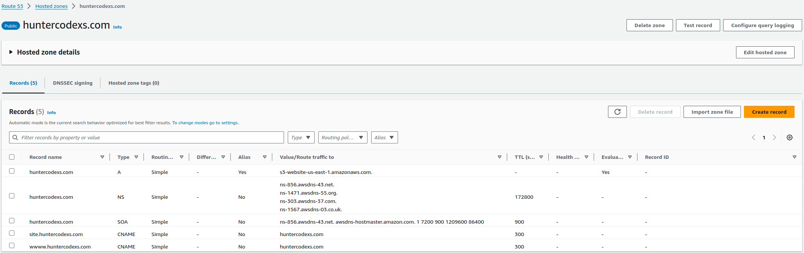
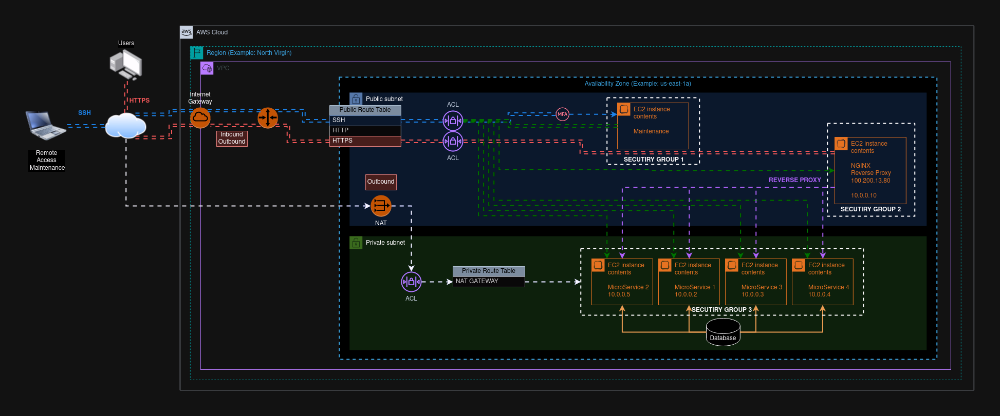

# AWS HELPER

## IAM

--------------------------------------------------------------------------------------------------------------------

###### Create a user step by step

- Login in the AWS Console with the administrator account
    - https://aws.amazon.com/
- Go to IAM control panel:
    - https://us-east-1.console.aws.amazon.com/iam/home?region=us-east-2
- Click: in the Item Menu on the left side named Users
    - Users
- Specify user details
    - User name
    - Custom password
- Click: Next
    - Mark Attach policies directly
        - Choose the related permissions
            - AdministrativeAccess (for example)
- Click: Next
- Click: Create user
- Click: Return to users list

Now you will probably visualize the Users list with the last one that was created in this step by step.
So make a logout from the current account and try login using the user that was created in the steps ago.

## BILLING

--------------------------------------------------------------------------------------------------------------------

###### Manage Billing Alarm

This setup is important to have a better control in the account costs and avoid surprises in the bills. For that click
on the link https://us-east-1.console.aws.amazon.com/billing/home#/preferences and check the following settings.

- Click in the [Edit] button - Alert preferences
- Mark the checkbox
    - Receive AWS Free Tier alerts
    - Receive CloudWatch billing alerts
- Click: Update

Now go to cloud watching and make the configurations as showed below

> Cloud Watch: https://console.aws.amazon.com/cloudwatch/home

- Click on the link Create alarms
- Click: Create alarm (button)
- Select Region: US East (N. Virginia)us-east-1
- Select metric
- Click on Billing link
- Click on Total Estimated Charge
- Mark the checkbox (Currency: USD)
- Click on Select metric (in the bottom right screen)
- Fill the form
- Choose Next button
- Select Notification Box
    - Fill the form to create a new Topic and inform the email to receive the alarm
- Click Next
- Give Alarm name
- Click Next
- Review the Configurations
- Finally, click Create alarm button

> IMPORTANT: Check your email address to Confirm "Simple Notification Service" and active this resource

## CLOUD-SHELL

--------------------------------------------------------------------------------------------------------------------

> ABOUT: Access the terminal commands in the AWS Cloud

## AWS-CLI

--------------------------------------------------------------------------------------------------------------------

> CLI: Command Line Interface

> To install and configure the amazon aws-cli follow the instructions in the follow page from AWS DOCS
https://docs.aws.amazon.com/cli/latest/userguide/getting-started-install.html

[Linux Installing]

<pre>
curl "https://awscli.amazonaws.com/awscli-exe-linux-x86_64.zip" -o "awscliv2.zip"
unzip awscliv2.zip
sudo ./aws/install
</pre>

[Linux Updating]

<pre>
curl "https://awscli.amazonaws.com/awscli-exe-linux-x86_64.zip" -o "awscliv2.zip"
unzip awscliv2.zip
sudo ./aws/install --bin-dir /usr/local/bin --install-dir /usr/local/aws-cli --update
</pre>

[Check Aws Version]

<pre>
aws --version
</pre>

[AWS CLI Configuration]

First of all you need to create the AccessKey to configure the aws-cli, then follow the steps below

- Click the Menu in the top right side in the screen
- Choose Security credentials
- Go down Access eys
    - Click Create access key button link
    - Choose the Command Line Interface (CLI)
        - Mark the checkbox
    - Click Next
    - Fill the questions in the form ahead
        - Save the generated Access Key and also the Secret access key
    - Click Done

- Execute the aws configuration steps

<pre>
aws configure
AWS Access Key ID [None]: AKIA5FTZ........
AWS Secret Access Key [None]: /N+htYqjH9cf68+1...................
Default region name [None]: us-east-1
Default output format [None]: json
</pre>

Now it's possible to execute all commands available for AWS Services, for example:

<pre>
aws s3 ls
aws ec2 describe-instances
</pre>

To get more details see the https://docs.aws.amazon.com/cli/latest/userguide/cli-chap-welcome.html

## EC2

--------------------------------------------------------------------------------------------------------------------

###### Create

To create an EC2 instance go to EC2 Dashboard and click in the item "Instance" placed at the Menu on the left side
screen, so you will fell down in EC2 Instances manager. Now you can follow the steps below to create a new instance.

- Click the "Launch instances" button in the top right screen
- Fill the form with the settings like below

[Name and tags]

- Name: your-instance-ec2-name (temporary-test-ec2)

[Application and OS Images (Amazon Machine Image)]

- Select the instance image: Amazon Linux, macOS, Ubuntu, Windows...
- Choose the AMI: Amazon Linux 2023
- Choose the architecture: 64-bit (x86)

[Instance type]

- Choose instance type: t2.micro (for Free tier eligible)

[Key pair]

- Create a key pair to SSH connections (don't forget to download and save it)
    - Click Create key pair (temporary-test-ec2)

[Network settings]

- Check VPC
- Check Subnet
- Check Public IP
- Choose the Firewall (security groups)
    - Create security group
        - Allow SSH traffic from [Anywhere: 0.0.0.0/0] (just for tests)
    - Select existing security group
        - default or any other one available

[Configure storage]

- Add volume if necessary

[Advanced details]

- Check the advanced details if necessary

Finally, click the button "Launch instance" placed in the bottom right from the screen.
Go back to the EC2 Instance list dashboard and check the instance status that was created in the steps ago.

So now get the Public IP from the instance created and connect via SSH, for example

<pre>
ssh -i "temporary-test-ec2.pem" ec2-user@ec2-54-152-4-44.compute-1.amazonaws.com
</pre>

> NOTE: Don't forget to give correct permissions for the pem file 400

In case the server is disconnecting in a short time you can change the file /etc/ssh/sshd_config to fix it

<pre>
ClientAliveInterval	300
ClientAliveCountMax	3
</pre>

###### Destroy Instance EC2

It's pretty important to terminate the instance to avoid charges and bills surprised,
so for that follow the steps below

- Go to your EC2 instance
- Choose 'Instance State'
- Select 'Terminate Instance'
- Check the Instance state: Terminated

## AMI - AMAZON MACHINE IMAGE

--------------------------------------------------------------------------------------------------------------------

To create an Amazon AMI and use in any EC2 instance follow the steps below:

- Get Access to the target AWS account
- Go to EC2 Instances Dashboard
- Choose the EC2 to create an AMI
- Click Actions in the top right screen
- Choose Images and Models
    - Create Image or Image Create
- Review the AMI form to make proper configuration
- Choose Create Image

Now you can use this AMI to create others EC2 instances with the same configurations, installations, applications and
features, it can save a lot of time when you need to put the new services or machines online.

- Go to AMI management
- Choose the AMI
- Click right button in the AMI
- Choose Execute Instance in the AMI
- Set up the Instance Details like
    - [Name and tags]
    - [Ami]
    - [Instance type]
    - [Key pairs]
    - [Network settings]
        - VPC
        - Allow SSH traffic from: {Anywhere, My IP}
        - Configure the use of SUB-NET
        - Common security groups
    - [Storage management]
    - [Advanced Details]
        - Termination Protection ?
        - Shutdown behavior: {Stop, Terminate}
- Click on the button Execute Instance
- Check if the instance was generated in the EC2 Instances Dashboard

--------------------------------------------------------------------------------------------------------------------

## S3

--------------------------------------------------------------------------------------------------------------------

#### Create a default bucket to storage files

S3 is a storage service that Amazon offer to storage files, also known as S3 Bucket. So to create a bucket and connect
in it to transfer any file to them follow the topics below

- Access your aws account
- Goto Amazon S3 in this link https://us-east-1.console.aws.amazon.com/s3/get-started?region=us-east-1
- Click on the link Buckets placed at left side of screen
- Choose Create bucket

  [General configuration]
    - AWS Region: US East (N. Virginia) us-east-1
    - Bucket type: General purpose
    - Bucket name: temporary-test-s3

  [Object Ownership]
    - Select ACLs disabled (recommended)

  [Block Public Access settings for this bucket]
    - Mark the pertinent checkbox to set up the correct access to the bucket
        - Block all public access [ ]
            - keep this checkbox marked unless you know what you are doing, for example: website hosting, in this case
              we are unmark this checkbox because we will test a single page in the S3 bucket

  [Bucket Versioning]
    - Bucket Versioning: Disable

  [Tags - optional (0)]
    - Let as is

  [Default encryption]
    - Encryption type: Server-side encryption with Amazon S3 managed keys (SSE-S3)
        - Bucket Key: Disable

  [Advanced settings]
    - Object Lock: Disable

- Choose Create bucket button

##### Testing bucket access

Now go back to the Bucket lists in the menu placed at left side og screen to check if the bucket was created in there.

If everything is ok, you can upload and download files to the created bucket, and also you can use the sample Java
project to transfer data for the bucket.

This project can be found in the following repository link https://github.com/huntercodexs/help4devs/tree/aws,
you just put the access_key_id and secret_access_key in the application properties file.

<pre>
### S3 Bucket
bucket.name=temporary-test-s3
cloud.aws.stack.auto=false
cloud.aws.region.static=us-east-1
cloud.aws.credentials.accessKey=AKIA5FTZ.................
cloud.aws.credentials.secretKey=/N+htYqjH9cf68+1fVybO.....................
</pre>

#### Hosting Static Website - Using ACLs

You can host one static website in the S3 bucket as following below.

- Create one specific bucket to host static website:

[General configuration]

- AWS Region: US East (N. Virginia) us-east-1
- Bucket Type: General purpose
- Bucket name: temporary-website-test-s3

[Object Ownership]

- Choose ACLs enabled
- Object Ownership
  - Choose Object writer
  - Unmark "Block Public Access settings for this bucket"
    - Mark "I acknowledge that the current settings might result in this bucket and the objects within becoming public."

[Bucket Versioning]

- Bucket Versioning:
  - Mark Disable

[Tags - optional]

> Let as is

[Default encryption]

- Encryption type:
  - Mark "Server-side encryption with Amazon S3 managed keys (SSE-S3)"
- Bucket Key:
  - Mark Disable

[Advanced settings]

- Object Lock:
  - Mark Disable

- Choose Create bucket

Now you will be redirected automatically to bucket list and probably the bucket it will be listed in that one. 
So now you can click on the temporary-website-test-s3 to visualize all options to configure this bucket.

- Choose the Upload button at middle of the screen to send the files into the bucket. 

> HTML Example to help you in this test

<code>

    <!DOCTYPE html>
    <html>
    <head>
        <meta charset="utf-8">
        <meta name="viewport" content="width=device-width, initial-scale=1">
        <title>Test</title>
    </head>
    <body>
    
    <h3>AWS S3 Bucket</h3>
    
    

        Hello AWS Services !!!
    

    
    </body>
    </html>

</code>

- After file uploaded, just click on Upload button placed at the bottom screen
- Also, you can upload one entirely folder that contains a website content
- Go to the bucket files list and choose the Properties Tab
- Scroll down until "Static website hosting" and click on Edit
- Mark "Static website hosting" as Enable
- Identify the index document
  - Index document: index.html
- Finally, click on Save changes
- Check and take note the URL created to access the static website (at the bottom of screen)
  - http://temporary-website-test-s3.s3-website-us-east-1.amazonaws.com

If you try to access the website right now, probably you will receive an HTTP error "403 Forbidden", because 
still need to make a few others changes in that bucket, so lets moving on.

- Scroll down until "Object Ownership" iIn the "Permissions Tab"
- Click on Edit
- Ensure that the "Bucket owner preferred" is marked
- Go back to "Objects Tab" select the files and folders
- Click on Actions menu
- Choose "Making public using ACL"
- Choose Make public button
- OK

Since for now, if everything was configured correctly you will be able to access the application website from 
the URL mentioned a few steps earlier, just for example:

> http://temporary-website-test-s3.s3-website-us-east-1.amazonaws.com

> NOTE: We don't have a DNS in this situation

#### Hosting a website - Using Bucket Policy

In this case we will use a complete environment to publish a static website with TLS and specific domain 
name, sSo let's get started and hands on.

> NOTE: In this case we will use the huntercodexs domain to create all configurations, so keep in your 
> mind that you should be changed this information for your current needed.

- Click on Create bucket button to create one specific bucket to host static website:
- Fill the form as follows

[General configuration]

- AWS Region: US East (N. Virginia) us-east-1
- Bucket Type: General purpose
- Bucket name: site.huntercodexs.com

[Object Ownership]

- Choose "ACLs disabled (recommended)"
- Block Public Access settings for this bucket
  - Mark "Block all public access"

[Bucket Versioning]

- Bucket Versioning:
    - Mark Disable

[Tags - optional]

> Let as is

[Default encryption]

- Encryption type:
    - Mark "Server-side encryption with Amazon S3 managed keys (SSE-S3)"
- Bucket Key:
    - Mark Enable

[Advanced settings]

- Object Lock:
    - Mark Disable

- Choose Create bucket

Now you will be redirected automatically to the bucket list and probably the created bucket it will be 
listed in that one. So now, you can click on the site.huntercodexs.com to visualize all options and configure 
this bucket.

- Choose the Upload button at middle of the screen to send the files into the bucket.

> HTML Example to help you in this test

<code>

    <!DOCTYPE html>
    <html>
    <head>
        <meta charset="utf-8">
        <meta name="viewport" content="width=device-width, initial-scale=1">
        <title>Test</title>
    </head>
    <body>
    
    <h3>AWS S3 Bucket</h3>
    
    

        Hello AWS Services !!!
    

    
    </body>
    </html>

</code>

- Click on Upload button 
- Go to S3 bucket details
- Click "Properties Tab"
  - Check if "Static website hosting" is Disabled
- Now click on "Permissions Tab"
  - Check if "Block public access (bucket settings)" is on
  - Click on Edit
  - Unmark the item "Block all public access"
    - Click on Save changes
      - Put confirm in the input text box
      - Click on Confirm button
  - Now the "Block public access (bucket settings)" is off
  - Still in the "Permissions Tab" scroll down until "Bucket policy" and click on Edit
    - Add the following policy

> IMPORTANT: Change the Resource field to your current Bucket ARN

<pre>
{
    "Version": "2012-10-17",
    "Id": "Policy1720049315656",
    "Statement": [
        {
            "Sid": "AllowPublicRead",
            "Effect": "Allow",
            "Principal": "*",
            "Action": "s3:GetObject",
            "Resource": "arn:aws:s3:::site.huntercodexs.com/*"
        }
    ]
}
</pre>

- Scroll down at the bottom of the page and click on Save changes
- Now go to "Properties Tab" and scroll down until "Static website hosting"
- Click on Edit
  - Mark Enable to "Static website hosting"
  - In "Hosting type" mark "Host a static website"
  - Give an index document name: index.html
  - Choose Save changes
- Still in the "Properties Tab" scroll down again until "Static website hosting" and get the URL generated
  - Example: http://site.huntercodexs.com.s3-website-us-east-1.amazonaws.com
  - If everything is ok, so you probably will receive the index.html page in your browser, do try it.

#### Hosting a website - Using friendly name

> NOTE: This step requires an DNS previously registered and activated in any DNS service provider, for more details 
> see the section Route-53 along this documentation

Since now, we are going to create a more friendly name to our static website because the current name that should 
be something like that site.huntercodexs.com.s3-website-us-east-1.amazonaws.com, and it is very confusing, 
stranger and hard to understand and memorize, and for that we will use the Route-53 from AWS Services, so let's go.

- Get access into Route-53
- Check the Region and Zone (normally in this case ís a Global)
- Look up for "Hosted zones" on the left side at the screen 
- Click on "Create hosted zone" button
- Fill the form with the following information

<pre>
Domain name: site.huntercodexs.com
Description (optional): 
Type: Public hosted zone
Tags:
</pre>

- Click on Create hosted zone

> IMPORTANT: Don't forget to configure your DNS service provider with the NS name services available in the hosted
> zone that you just have created, this information can be grabbed in the "Hosted zone details"

- Now you will be probably redirected to site.huntercodexs.com hosted zone, where you will see one list of records to 
routes and DNS configurations, so for now click on Create record and follow the steps below

<pre>
Record name: (huntercodexs.com)
Record type: A - Routes traffic to an IPv4 address and some AWS resoruces
Alias: Marked
Route traffic to: 
  - Alias to S3 website endpoint
  - US East (N. Virginia)
  - s3-website-us-east-1.amazonaws.com
Routing policy: Simple routing
</pre>

- Click on Create records button
- Now, create another two record like below

<pre>
Record name: site (site.huntercodexs.com)
Record type: CNAME – routes traffic to another domain name and to some AWS resources
Value: huntercodexs.com
TTL(seconds): 300
Routing policy: Simple routing
</pre>

<pre>
Record name: www (www.huntercodexs.com)
Record type: CNAME – routes traffic to another domain name and to some AWS resources
Value: huntercodexs.com
TTL(seconds): 300
Routing policy: Simple routing
</pre>

- Click on Create records button

- Now, access the static website using the new name: 
  - http://huntercodexs.com
  - http://site.huntercodexs.com
  - http://www.huntercodexs.com

> NOTE: This can take a several times to be activated by your DNS service provider

- The image below show the Route53 configured and running

## ROUTE 53

--------------------------------------------------------------------------------------------------------------------

#### Create Redirect to EC2 Instance

To get start the Route 53 configuration have in hand the following information

> NOTE: All information about one specific hosted zone can be obtained at section "Hosted zone details" in the 
> proper hosted zone at top of that

<pre>
    #DNS na AWS
    ns-1234.awsdns-00.org
    ns-1234.awsdns-00.co.uk
    ns-1234.awsdns-00.com
    ns-1234.awsdns-00.net

    #DNS in the domain server
    ns1.dns-parking.com
</pre>

- In the AWS manager console seek by Route 53 and click in it.

- If you have a hosted zone on Route 53, click on the "Hosted zone" link to access the options for
  zone management, and on this screen it is possible to create a new zone or edit an existing one. 

- You, too, can use the menu on the left side of the "Hosted Zones" screen to access this screen.

- Both in the previous case and in the case of being the first zone to be created, click on the "Create hosted zone" button.

- On the zone creation screen, enter the domain name, comment and type (public).

- When clicking on Create you will be directed to the created zone/domain screen, where you can carry out the
  settings necessary to activate routing for it.

- Click on Create record to be directed to the configuration screen for the record/domain to be routed.

- Fill in the registration name, choose the type of registration, in value enter the IP (or Elastic IP) of the machine
  which is in the cloud on AWS, TTL and Routing Policy, for example:

<pre>
Registration name: your-domain.com or www.your-domain.com
Record Type: A – Routes traffic to an IPv4 address and some AWS resources
Value: 54.51.92.190 (Elastic IP)
TTL: 300 (seconds)
Routing policy: Simple routing
</pre>

<pre>
Registration name: your-domino.com or www.your-domain.com
Record type: CNAME – routes traffic to another domain name and to some AWS resources
Value: your-domain.com
TTL: 300 (seconds)
Routing policy: Simple routing
</pre>

- Obtain DNS data from AWS to insert into your hosting or registry server, for example:
<pre>
ns-1234.awsdns-00.org
ns-1234.awsdns-00.co.uk
ns-1234.awsdns-00.com
ns-1234.awsdns-00.net
</pre>

- Go to your hosting or registration service, DNS management panel and enter one by one the DNS entered by AWS.

> NOTE: You may need to wait a few moments for the redirection and feature activation to take effect.

#### Create a Redirect to S3 AWS Resource

- Access the AWS Account
- Go to Route-53 service
- Look for Hosted zones
- Click on Create hosted zone button
- In the form to create a hosted zone
  - Domain name: you-domain.com
  - Description(optional): Desc....
  - Type: Public hosted zone
  - Tags: ...
  - Click on Created hosted zone
- Now go back to Hosted zone list, you will probably see the hosted zone created in that list
- Click on the hosted zone that you just have created link
- Now, if everything was made correctly, you should be able to see the NS Servers available for your account/domain, 
for example:

<pre>
ns-1234.awsdns-00.org
ns-1234.awsdns-00.co.uk
ns-1234.awsdns-00.com
ns-1234.awsdns-00.net
</pre>

- Note that the expected type for the correct record must be "NS
- Now, go to your service provider DNS in the web
- Put the DNS servers from AWS in the DNS Servers in the proper section in your current service provider
- Click on Save to activate the changes

> NOTE: To do that you need to have an account and domain registered in any register domain service, for example:
> GoDaddy, UOL, Hostinger, Alligator among others. So go to in the section DSM/Nameservers from your current
> service provider and get the DNS Servers that are affordable in there.

- Go back to Route-53 in your AWS account
- Click on the target hosted zone link to edit it
- Click on Create record button to create the first record, and follow the information below:

<pre>
Registration name: www (www.your-domain.com)
Record type: CNAME – routes traffic to another domain name and to some AWS resources
Value: http://your-domain.com
TTL: 300 (seconds)
Routing policy: Simple routing
</pre>

- Click on Save button, and that's it
- Now, let's go created a second record in the hosted zone
- Click on Create record again in the same hosted zone, and follow the information below:

<pre>
Registration name: s3 (s3.your-domain.com)
Record type: CNAME – routes traffic to another domain name and to some AWS resources
Value: s3.your-domain.com.amazon-aws-bucket
TTL: 300 (seconds)
Routing policy: Simple routing
</pre>

- Choose Create records button
- Test the access using your web browser

> NOTE: You may need to wait a few moments for the redirection and feature activation to take effect.

## CLOUD FRONT

--------------------------------------------------------------------------------------------------------------------

#### Create distribution

Below is how to create a sample distribution in the Cloud Front.
Follow these steps to delivery a content successfully. 

- Origin

<pre>
Origin domain: help4devs.com.s3.us-east-1.amazonaws.com
### Do not choose the "Use website endpoint"
Origin path - optional: 
Name: help4devs.com.s3.us-east-1.amazonaws.com
Origin access: Public
Add custom header - optional: 
Enable Origin Shield: No
</pre>

- Default cache behavior

<pre>
Path pattern: Default (*)
Compress objects automatically: Yes
</pre>

Viewer

<pre>
Viewer protocol policy: Redirect HTTP to HTTPS
Allowed HTTP methods: GET, HEAD
Restrict viewer access: No
</pre>

Cache key and origin requests

<pre>
Cache policy and origin request policy (recommended): Marked
Response headers policy - optional:
</pre>

- Function associations - optional

<pre>
Viewer request: No association
Viewer response: No association
Origin request: No association
Origin response: No association
</pre>

- Web Application Firewall (WAF)

<pre>
Do not enable security protections: Marked
</pre>

- Settings

<pre>
Price class: Use all edge locations (best performance)
Alternate domain name (CNAME) - optional: help4devs.com
Custom SSL certificate - optional: Custom SSL certificate - optional (17761472-a01d-422e-9fdf-5e6c14a0f558)
Security Policy: TLSv1.2_2021 (recommended)
Supported HTTP versions: HTTP/2
Default root object - optional: index.html
Standard logging: Off
IPv6: On
Description - optional: website help4devs
</pre>

#### Testing Distribution

- You can test the access using the "Distribution domain name" placed in the "General Tab" inside the current 
"Cloud Front Distributed" that you just have created, for example:

<pre>
https://dijdcwprgmu5e.cloudfront.net
</pre>

#### Create a new record in the Route-53

- In the Route-53 look up for the target hosted zone and click on it
- Now, create a new record clicking on Create record button
- Fill the form as follows

<pre>
Record name: (help4devs.com)
Record type: A - Routes traffic to an IPv4 address and some AWS resources
Alias: Marked
Route traffic to: Alias to Cloud Front distribution
Region: US East (N. Virginia)
Distribution: (help4dev.com) dijdcwprgmu5e.cloudfront.net
Routing policy: Simple routing
</pre>

- Choose Create record button
- Testing your cloud front application access via HTTP/HTTPS, for example:
  - http://help4devs.com (should be redirected to HTTPS automatically)
  - https://help4devs.com

## SQS

--------------------------------------------------------------------------------------------------------------------

## ECS

--------------------------------------------------------------------------------------------------------------------

## EKS

--------------------------------------------------------------------------------------------------------------------

## RDS

--------------------------------------------------------------------------------------------------------------------

## DYNAMODB

--------------------------------------------------------------------------------------------------------------------

## API-GATEWAY

--------------------------------------------------------------------------------------------------------------------

## LAMBDA FUNCTIONS

--------------------------------------------------------------------------------------------------------------------

## LOAD BALANCER

--------------------------------------------------------------------------------------------------------------------

## ACM

--------------------------------------------------------------------------------------------------------------------

## VPC

--------------------------------------------------------------------------------------------------------------------

## ACL

--------------------------------------------------------------------------------------------------------------------

## SECURITY GROUP

--------------------------------------------------------------------------------------------------------------------

## COSTS ESTIMATES

--------------------------------------------------------------------------------------------------------------------

## AWS NETWORKING

--------------------------------------------------------------------------------------------------------------------

In this topic we can see one small concept project to view how to work an environment based on AWS Cloud services.
Belo is the overview image to presentation this subject in a quickly and understandably way.

As we can see in the above image, there is a lot of resources used from AWS Cloud services that those are describe as
follows below:

- AWS CLOUD
- REGION
- VPC
- INTERNET GATEWAY
    - ROUTER
        - AVAILABILITY ZONE
        - PUBLIC ROUTER TABLE
            - ACL
                - PUBLIC SUBNET
                    - SECURITY GROUP 1
                        - MFA
                            - EC2 - MAINTENANCE
                    - SECURITY GROUP 2
                        - EC2 - NGINX REVERSE PROXY
            - NAT INTERNET
        - PRIVATE ROUTER TABLE
            - ACL
                - PRIVATE SUBNET
                    - SECURITY GROUP 3
                        - EC2 - MICROSERVICE
                            - QUANTITY = 4
                                - SERVICE1 = hello-world-1.jar
                                - SERVICE2 = hello-world-2.jar
                                - SERVICE3 = hello-world-3.jar
                                - SERVICE4 = hello-world-4.jar
                        - DATABASE
                            - RDS: MYSQL

