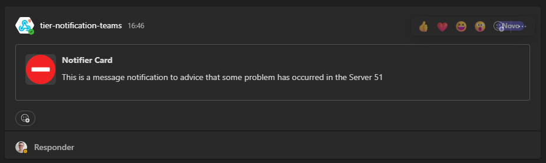
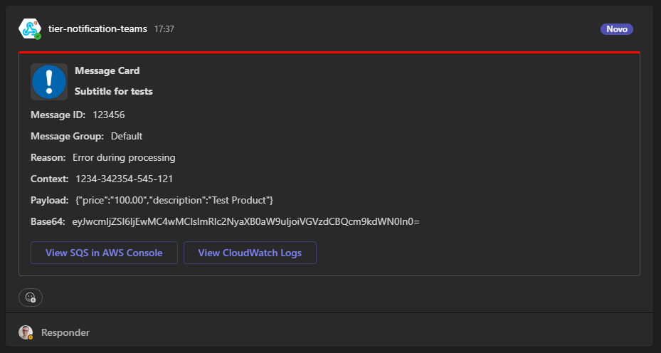
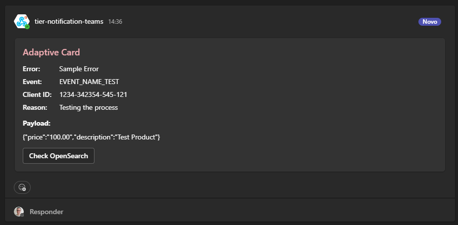
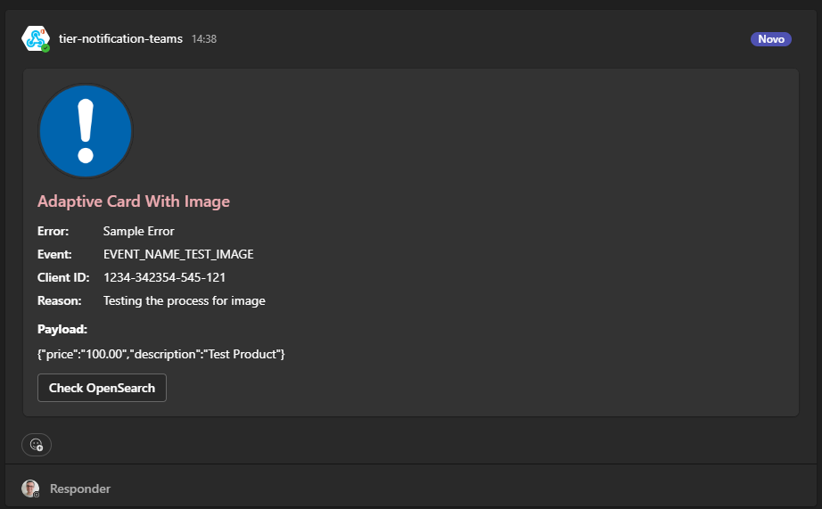
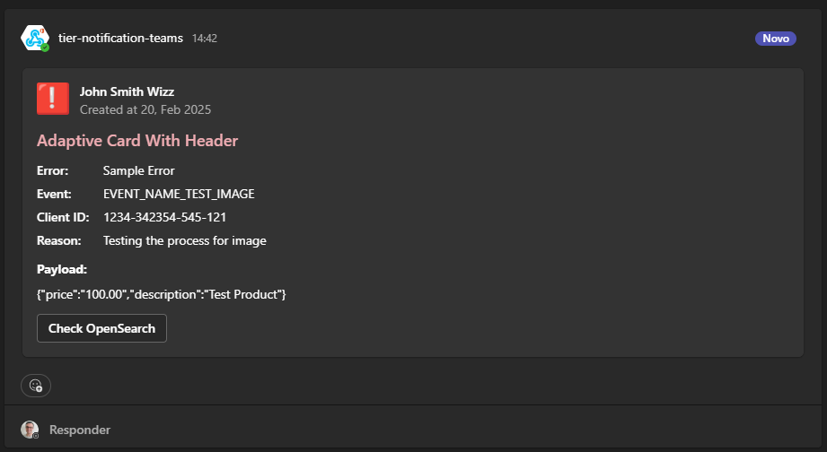
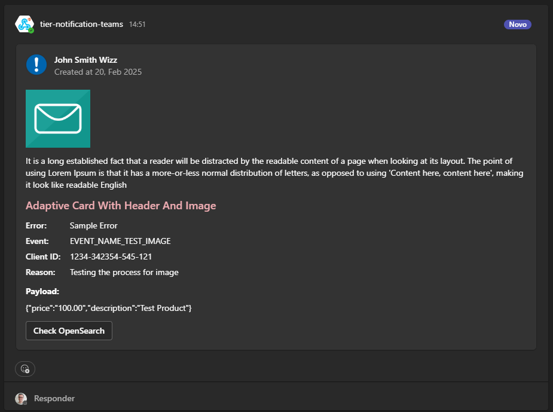

# Teams Card Layout

# Implementation

Images Sample

- ALERT - https://cdn.pixabay.com/photo/2021/10/09/10/17/block-6693735_1280.png
- SQS - https://www.apono.io/wp-content/uploads/2023/05/amazon-sqs-min.png
- INFO - https://cdn.pixabay.com/photo/2013/04/01/10/54/warning-98596_1280.png
- WARNING - https://cdn.pixabay.com/photo/2023/03/13/20/11/exclamation-mark-7850668_1280.png
- MESSAGE - https://cdn.pixabay.com/photo/2014/05/18/18/34/icon-347234_1280.png

<code>

    @Component
    @AllArgsConstructor
    public class TicketPaymentStrategyImpl implements PaymentStrategy {
    
        private TeamsCard teamsCard;

        @Override
        public void notify(NotifierModel notifier) {

            try {

                String teamsCardLayout = teamsCard.messageCard(notifier.getPayload());
                //String teamsCardLayout = teamsCard.adaptiveCardSimple(notifier.getPayload());
                //String teamsCardLayout = teamsCard.adaptiveCardImage(notifier.getPayload());
                //String teamsCardLayout = teamsCard.adaptiveCardTable(notifier.getPayload());
                //String teamsCardLayout = teamsCard.adaptiveCardTableImage(notifier.getPayload());

                RestClient teamsClient = new RestClient();
                ResponseEntity<?> response = teamsClient
                        .setUrl("{TEAMS-WEBHOOK}")
                        .setBodyRequest(teamsCardLayout)
                        .setBodyRequestType(String.class)
                        .post();
    
                System.out.println(response);
    
            } catch (RuntimeException re) {
                System.out.println(">>>>>");
                System.out.println(re.getMessage());
            }
        }

    }

</code>

# Layouts Available

- Notifier Card
- Message Card
- Adaptive Card
- Adaptive Card With Image
- Adaptive Card With Header
- Adaptive Card With Header And Image

# Notifier Card

Code Suggestion

<code>

        String teamsCardLayout = teamsCard.notifierCard(
                "**Notifier Card**",
                "This is a message notification to advice that some problem has occurred in the Server 51",
                "{IMAGE-URL}");

</code>

Card Structure Sample
<pre>
{
   "type":"MessageCard",
   "context":"http://schema.org/extensions",
   "summary":"Notifier",
   "sections":[
      {
         "activityTitle":"**Notifier Card**",
         "activitySubtitle":"This is a message notification to advice that some problem has occurred in the Server 51",
         "activityImage":"{IMAGE-URL}"
      }
   ]
}
</pre>

Card Graphics Result

# Message Card

Code Suggestion

<code>

        List<Facts> factsList = new ArrayList<>();
        factsList.add(Facts.builder().name(MESSAGE_ID).value("123456").build());
        factsList.add(Facts.builder().name(MESSAGE_GID).value("Default").build());
        factsList.add(Facts.builder().name(REASON).value("Error during processing").build());
        factsList.add(Facts.builder().name(CONTEXT).value("1234-342354-545-121").build());
        factsList.add(Facts.builder().name(PAYLOAD).value(notifier.getPayload()).build());
        factsList.add(Facts.builder().name(PAYLOAD_B64).value(Base64.getEncoder().encodeToString(notifier.getPayload().translateEscapes().getBytes())).build());

        List<PotentialAction> actionList = new ArrayList<>();

        List<Targets> targetsList1 = new ArrayList<>();
        targetsList1.add(Targets.builder().os(TARGET_OS_DEFAULT).uri("https://sqs.action.com/test").build());
        actionList.add(PotentialAction.builder().name(SQS_ACTION).targets(targetsList1).build());

        List<Targets> targetsList2 = new ArrayList<>();
        targetsList2.add(Targets.builder().os(TARGET_OS_DEFAULT).uri("https://aws.action.com/test").build());
        actionList.add(PotentialAction.builder().name(AWS_CLOUD_WATCH_ACTION).targets(targetsList2).build());

        String teamsCardLayout = teamsCard.messageCard(
                THEME_RED,
                "Summary Test",
                "**Message Card**",
                "**Subtitle for tests**",
                "https://cdn.pixabay.com/photo/2013/04/01/10/54/warning-98596_1280.png",
                factsList,
                actionList);

</code>

Card Structure Sample
<pre>
{
   "@type":"MessageCard",
   "@context":"http://schema.org/extensions",
   "themeColor":"FF0000",
   "summary":"Summary Test",
   "sections":[
      {
         "activityTitle":"**Message Card**",
         "activitySubtitle":"**Subtitle for tests**",
         "activityImage":"{IMAGE-URL}",
         "facts":[
            {
               "name":"Message ID:",
               "value":"123456"
            },
            {
               "name":"Message Group:",
               "value":"Default"
            },
            {
               "name":"Reason:",
               "value":"Error during processing"
            },
            {
               "name":"Context:",
               "value":"1234-342354-545-121"
            },
            {
               "name":"Payload:",
               "value":"{\"price\":\"100.00\",\"description\":\"Test Product\"}"
            },
            {
               "name":"Base64:",
               "value":"eyJwcmljZSI6IjEwMC4wMCIsImRlc2NyaXB0aW9uIjoiVGVzdCBQcm9kdWN0In0="
            }
         ]
      }
   ],
   "potentialAction":[
      {
         "@type":"OpenUri",
         "name":"View SQS in AWS Console",
         "targets":[
            {
               "os":"default",
               "uri":"{ACTION-URL-1}"
            }
         ]
      },
      {
         "@type":"OpenUri",
         "name":"View CloudWatch Logs",
         "targets":[
            {
               "os":"default",
               "uri":"{ACTION-URL-2}"
            }
         ]
      }
   ]
}
</pre>

Card Graphics Result

# Adaptive Card

Code Suggestion

<code>

        List<AdaptiveCardFacts> factsList = new ArrayList<>();
        factsList.add(AdaptiveCardFacts.builder().title(ERROR).value("Sample Error").build());
        factsList.add(AdaptiveCardFacts.builder().title(EVENT).value("EVENT_NAME_TEST").build());
        factsList.add(AdaptiveCardFacts.builder().title(CLIENT).value("1234-342354-545-121").build());
        factsList.add(AdaptiveCardFacts.builder().title(REASON).value("Testing the process").build());

        List<Actions> actionList = new ArrayList<>();
        actionList.add(Actions
                .builder()
                .title(OPENSEARCH_ACTION)
                .url("{URL-ACTION}")
                .build());

        String teamsCardLayout = teamsCard.adaptiveCard(
                notifier.getPayload(),
                "Adaptive Card",
                factsList,
                actionList,
                FONT_COLOR_ORANGE);

</code>

Card Structure Sample
<pre>
{
   "type":"message",
   "attachments":[
      {
         "contentType":"application/vnd.microsoft.card.adaptive",
         "content":{
            "$schema":"http://adaptivecards.io/schemas/adaptive-card.json",
            "type":"AdaptiveCard",
            "version":"1.4",
            "msteams":{
               "width":"Full"
            },
            "body":[
               {
                  "type":"TextBlock",
                  "size":"large",
                  "weight":"bolder",
                  "text":"Adaptive Card",
                  "color":"attention"
               },
               {
                  "type":"FactSet",
                  "facts":[
                     {
                        "title":"Error:",
                        "value":"Sample Error"
                     },
                     {
                        "title":"Event:",
                        "value":"EVENT_NAME_TEST"
                     },
                     {
                        "title":"Client ID:",
                        "value":"1234-342354-545-121"
                     },
                     {
                        "title":"Reason:",
                        "value":"Testing the process"
                     }
                  ]
               },
               {
                  "type":"TextBlock",
                  "text":"**Payload:**",
                  "weight":"Bolder"
               },
               {
                  "type":"TextBlock",
                  "text":"{\"price\":\"100.00\",\"description\":\"Test Product\"}",
                  "wrap":true,
                  "spacing":"Small"
               },
               {
                  "type":"ActionSet",
                  "actions":[
                     {
                        "type":"Action.OpenUrl",
                        "title":"Check OpenSearch",
                        "url":"{URL-ACTION}"
                     }
                  ]
               }
            ]
         }
      }
   ]
}
</pre>

Card Graphics Result

# Adaptive Card With Image

Code Suggestion

<code>

        List<AdaptiveCardFacts> factsList = new ArrayList<>();
        factsList.add(AdaptiveCardFacts.builder().title(ERROR).value("Sample Error").build());
        factsList.add(AdaptiveCardFacts.builder().title(EVENT).value("EVENT_NAME_TEST_IMAGE").build());
        factsList.add(AdaptiveCardFacts.builder().title(CLIENT).value("1234-342354-545-121").build());
        factsList.add(AdaptiveCardFacts.builder().title(REASON).value("Testing the process for image").build());

        List<Actions> actionList = new ArrayList<>();
        actionList.add(Actions
                .builder()
                .title(OPENSEARCH_ACTION)
                .url("{ACTION-URL}")
                .build());

        String teamsCardLayout = teamsCard.adaptiveCardWithImage(
                notifier.getPayload(),
                "Adaptive Card With Image",
                "https://www.apono.io/wp-content/uploads/2023/05/amazon-sqs-min.png",
                "Alternative Text Sample",
                factsList,
                actionList,
                FONT_COLOR_GREEN);

</code>

Card Structure Sample
<pre>
{
   "type":"message",
   "attachments":[
      {
         "contentType":"application/vnd.microsoft.card.adaptive",
         "content":{
            "$schema":"http://adaptivecards.io/schemas/adaptive-card.json",
            "type":"AdaptiveCard",
            "version":"1.4",
            "msteams":{
               "width":"Full"
            },
            "body":[
               {
                  "type":"Image",
                  "size":"large",
                  "altText":"Alternative Text Sample",
                  "url":"{URL-IMAGE}",
                  "spacing":"large"
               },
               {
                  "type":"TextBlock",
                  "size":"large",
                  "weight":"bolder",
                  "text":"Adaptive Card With Image",
                  "color":"attention"
               },
               {
                  "type":"FactSet",
                  "facts":[
                     {
                        "title":"Error:",
                        "value":"Sample Error"
                     },
                     {
                        "title":"Event:",
                        "value":"EVENT_NAME_TEST_IMAGE"
                     },
                     {
                        "title":"Client ID:",
                        "value":"1234-342354-545-121"
                     },
                     {
                        "title":"Reason:",
                        "value":"Testing the process for image"
                     }
                  ]
               },
               {
                  "type":"TextBlock",
                  "text":"**Payload:**",
                  "weight":"Bolder"
               },
               {
                  "type":"TextBlock",
                  "text":"{\"price\":\"100.00\",\"description\":\"Test Product\"}",
                  "wrap":true,
                  "spacing":"Small"
               },
               {
                  "type":"ActionSet",
                  "actions":[
                     {
                        "type":"Action.OpenUrl",
                        "title":"Check OpenSearch",
                        "url":"{URL-ACTION}"
                     }
                  ]
               }
            ]
         }
      }
   ]
}
</pre>

Card Graphics Result

# Adaptive Card With Header

Code Suggestion

<code>

        List<AdaptiveCardFacts> factsList = new ArrayList<>();
        factsList.add(AdaptiveCardFacts.builder().title(ERROR).value("Sample Error").build());
        factsList.add(AdaptiveCardFacts.builder().title(EVENT).value("EVENT_NAME_TEST_IMAGE").build());
        factsList.add(AdaptiveCardFacts.builder().title(CLIENT).value("1234-342354-545-121").build());
        factsList.add(AdaptiveCardFacts.builder().title(REASON).value("Testing the process for image").build());

        List<ColumnsSet> columnsList = new ArrayList<>();

        List<ItemsObject> itemCardList1 = new ArrayList<>();
        itemCardList1.add(ItemsObject
                .builder()
                .type(TYPE_IMAGE)
                .style(STYLE_DEFAULT)
                .url("https://cdn.pixabay.com/photo/2014/05/18/18/34/icon-347234_1280.png")
                .altText("Alternative Text Test")
                .size(SIZE_SMALL)
                .build());

        columnsList.add(ColumnsSet.builder().items(itemCardList1).width("auto").build());

        List<ItemsObject> itemCardList2 = new ArrayList<>();
        itemCardList2.add(ItemsObject
                .builder()
                .type(TYPE_TEXT)
                .weight(WEIGHT_BOLDER)
                .text("John Smith Wizz")
                .wrap(WRAP_TRUE)
                .build());
        itemCardList2.add(ItemsObject
                .builder()
                .type(TYPE_TEXT)
                .spacing(SPACING_NONE)
                .text("Created at 20, Feb 2025")
                .isSubtle(SUBTLE_TRUE)
                .wrap(WRAP_TRUE)
                .build());

        columnsList.add(ColumnsSet.builder().items(itemCardList2).width("stretch").build());

        List<Actions> actionList = new ArrayList<>();
        actionList.add(Actions
                .builder()
                .title(OPENSEARCH_ACTION)
                .url("https://action.com/api/test")
                .build());

        String teamsCardLayout = teamsCard.adaptiveCardWithHeader(
                notifier.getPayload(),
                "Adaptive Card With Header",
                factsList,
                columnsList,
                actionList);

</code>

Card Structure Sample
<pre>
{
   "type":"message",
   "attachments":[
      {
         "contentType":"application/vnd.microsoft.card.adaptive",
         "content":{
            "$schema":"http://adaptivecards.io/schemas/adaptive-card.json",
            "type":"AdaptiveCard",
            "version":"1.4",
            "msteams":{
               "width":"Full"
            },
            "body":[
               {
                  "type":"ColumnSet",
                  "columns":[
                     {
                        "type":"Column",
                        "items":[
                           {
                              "type":"Image",
                              "style":"Default",
                              "size":"Small",
                              "altText":"Alternative Text Test",
                              "url":"{IMAGE-URL}"
                           }
                        ],
                        "width":"auto"
                     },
                     {
                        "type":"Column",
                        "items":[
                           {
                              "type":"TextBlock",
                              "text":"John Smith Wizz",
                              "weight":"Bolder",
                              "wrap":"true"
                           },
                           {
                              "type":"TextBlock",
                              "text":"Created at 20, Feb 2025",
                              "spacing":"None",
                              "wrap":"true",
                              "isSubtle":"true"
                           }
                        ],
                        "width":"stretch"
                     }
                  ]
               },
               {
                  "type":"TextBlock",
                  "size":"large",
                  "weight":"bolder",
                  "text":"Adaptive Card With Header",
                  "color":"attention"
               },
               {
                  "type":"FactSet",
                  "facts":[
                     {
                        "title":"Error:",
                        "value":"Sample Error"
                     },
                     {
                        "title":"Event:",
                        "value":"EVENT_NAME_TEST_IMAGE"
                     },
                     {
                        "title":"Client ID:",
                        "value":"1234-342354-545-121"
                     },
                     {
                        "title":"Reason:",
                        "value":"Testing the process for image"
                     }
                  ]
               },
               {
                  "type":"TextBlock",
                  "text":"**Payload:**",
                  "weight":"Bolder"
               },
               {
                  "type":"TextBlock",
                  "text":"{\"price\":\"100.00\",\"description\":\"Test Product\"}",
                  "wrap":true,
                  "spacing":"Small"
               },
               {
                  "type":"ActionSet",
                  "actions":[
                     {
                        "type":"Action.OpenUrl",
                        "title":"Check OpenSearch",
                        "url":"https://action.com/api/test"
                     }
                  ]
               }
            ]
         }
      }
   ]
}
</pre>

Card Graphics Result

# Adaptive Card With Header And Image 
* using text about

Code Suggestion

<code>

        List<AdaptiveCardFacts> factsList = new ArrayList<>();
        factsList.add(AdaptiveCardFacts.builder().title(ERROR).value("Sample Error").build());
        factsList.add(AdaptiveCardFacts.builder().title(EVENT).value("EVENT_NAME_TEST_IMAGE").build());
        factsList.add(AdaptiveCardFacts.builder().title(CLIENT).value("1234-342354-545-121").build());
        factsList.add(AdaptiveCardFacts.builder().title(REASON).value("Testing the process for image").build());

        List<ColumnsSet> columnsList = new ArrayList<>();

        List<ItemsObject> itemCardList1 = new ArrayList<>();
        itemCardList1.add(ItemsObject
                .builder()
                .type(TYPE_IMAGE)
                .style(STYLE_DEFAULT)
                .url("https://cdn.pixabay.com/photo/2021/10/09/10/17/block-6693735_1280.png")
                .altText("Alternative Text Test")
                .size(SIZE_SMALL)
                .build());

        columnsList.add(ColumnsSet.builder().items(itemCardList1).width("auto").build());

        List<ItemsObject> itemCardList2 = new ArrayList<>();
        itemCardList2.add(ItemsObject
                .builder()
                .type(TYPE_TEXT)
                .weight(WEIGHT_BOLDER)
                .text("John Smith Wizz")
                .wrap(WRAP_TRUE)
                .build());
        itemCardList2.add(ItemsObject
                .builder()
                .type(TYPE_TEXT)
                .spacing(SPACING_NONE)
                .text("Created at 20, Feb 2025")
                .isSubtle(SUBTLE_TRUE)
                .wrap(WRAP_TRUE)
                .build());

        columnsList.add(ColumnsSet.builder().items(itemCardList2).width("stretch").build());

        List<Actions> actionList = new ArrayList<>();
        actionList.add(Actions
                .builder()
                .title(OPENSEARCH_ACTION)
                .url("https://action.com/api/test")
                .build());

        String teamsCardLayout = teamsCard.adaptiveCardWithHeaderAndImage(
                notifier.getPayload(),
                "Adaptive Card With Header And Image",
                "https://cdn.pixabay.com/photo/2013/04/01/10/54/warning-98596_1280.png",
                "It is a long established fact that a reader will be distracted by the readable content of a page when looking at its layout. The point of using Lorem Ipsum is that it has a more-or-less normal distribution of letters, as opposed to using 'Content here, content here', making it look like readable English",
                factsList,
                columnsList,
                actionList,
                FONT_COLOR_BLUE);

</code>

Card Structure Sample
<pre>
{
   "type":"message",
   "attachments":[
      {
         "contentType":"application/vnd.microsoft.card.adaptive",
         "content":{
            "$schema":"http://adaptivecards.io/schemas/adaptive-card.json",
            "type":"AdaptiveCard",
            "version":"1.4",
            "msteams":{
               "width":"Full"
            },
            "body":[
               {
                  "type":"ColumnSet",
                  "columns":[
                     {
                        "type":"Column",
                        "items":[
                           {
                              "type":"Image",
                              "style":"Default",
                              "size":"Small",
                              "altText":"Alternative Text Test",
                              "url":"{IMAGE-URL}"
                           }
                        ],
                        "width":"auto"
                     },
                     {
                        "type":"Column",
                        "items":[
                           {
                              "type":"TextBlock",
                              "text":"John Smith Wizz",
                              "weight":"Bolder",
                              "wrap":"true"
                           },
                           {
                              "type":"TextBlock",
                              "text":"Created at 20, Feb 2025",
                              "spacing":"None",
                              "wrap":"true",
                              "isSubtle":"true"
                           }
                        ],
                        "width":"stretch"
                     }
                  ]
               },
               {
                  "type":"Image",
                  "size":"large",
                  "url":"{IMAGE-URL}",
                  "spacing":"large"
               },
               {
                  "type":"TextBlock",
                  "text":"It is a long established fact that a reader will be distracted by the readable content of a page when looking at its layout. The point of using Lorem Ipsum is that it has a more-or-less normal distribution of letters, as opposed to using \u0027Content here, content here\u0027, making it look like readable English",
                  "wrap":"true"
               },
               {
                  "type":"TextBlock",
                  "size":"large",
                  "weight":"bolder",
                  "text":"Adaptive Card With Header And Image",
                  "color":"attention"
               },
               {
                  "type":"FactSet",
                  "facts":[
                     {
                        "title":"Error:",
                        "value":"Sample Error"
                     },
                     {
                        "title":"Event:",
                        "value":"EVENT_NAME_TEST_IMAGE"
                     },
                     {
                        "title":"Client ID:",
                        "value":"1234-342354-545-121"
                     },
                     {
                        "title":"Reason:",
                        "value":"Testing the process for image"
                     }
                  ]
               },
               {
                  "type":"TextBlock",
                  "text":"**Payload:**",
                  "weight":"Bolder"
               },
               {
                  "type":"TextBlock",
                  "text":"{\"price\":\"100.00\",\"description\":\"Test Product\"}",
                  "wrap":true,
                  "spacing":"Small"
               },
               {
                  "type":"ActionSet",
                  "actions":[
                     {
                        "type":"Action.OpenUrl",
                        "title":"Check OpenSearch",
                        "url":"https://action.com/api/test"
                     }
                  ]
               }
            ]
         }
      }
   ]
}
</pre>

Card Graphics Result

